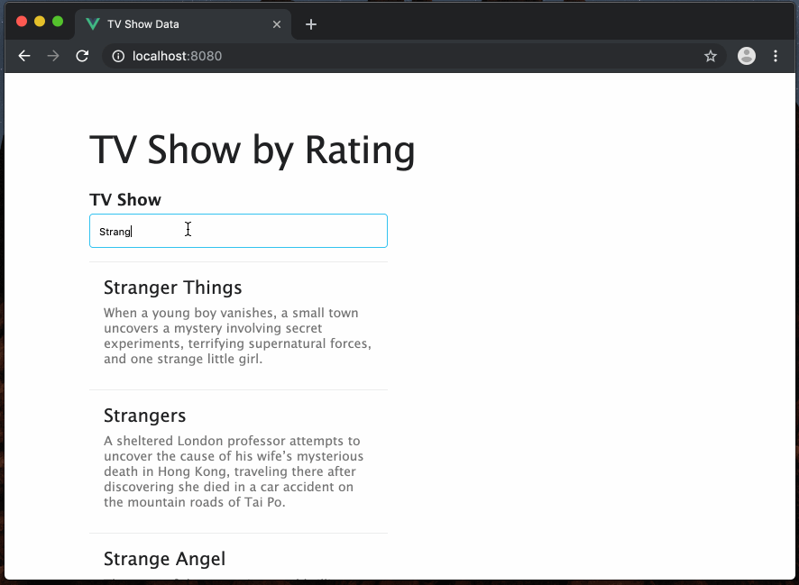

# Ratings 🎬

## About
Web app for viewing ratings by episode from [The Movie DB](https://www.themoviedb.org/) with a backend built in Node/Express and the UI built in Vue.js.  Based on the project [Express GCP](https://github.com/cortl/express-gcp)

## Getting Started

### Installing
1. `npm install`

### Usage & Developing
1. `npm run dev`
3. Develop! 🎉